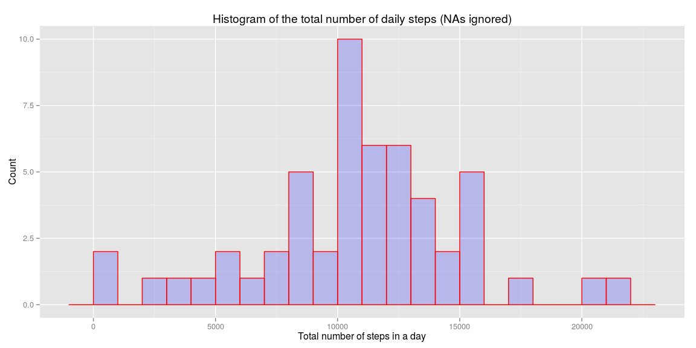
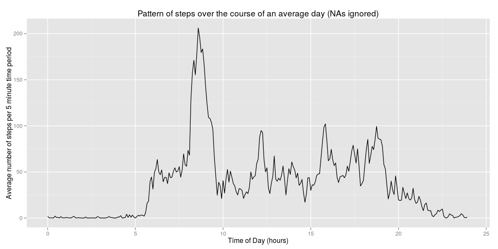
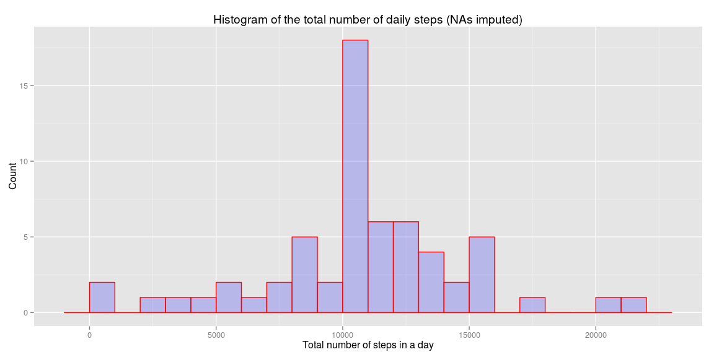
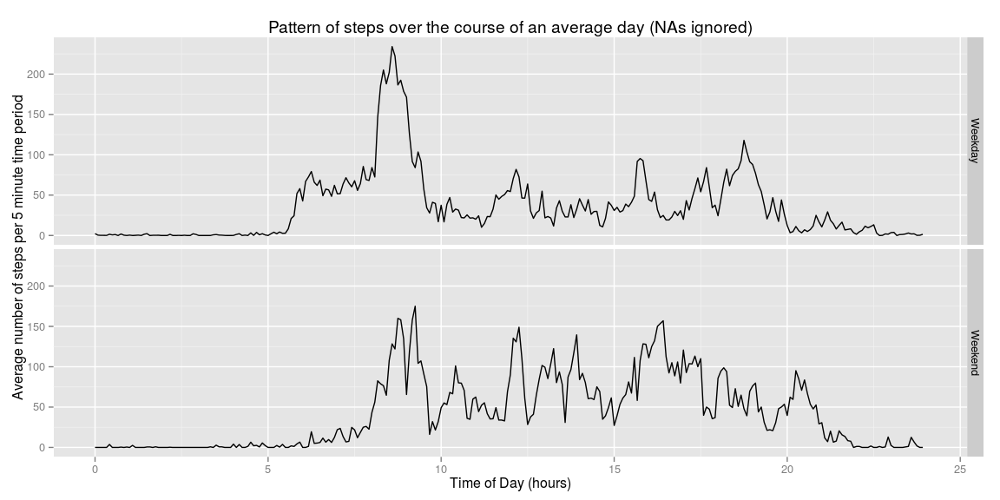

# Reproducible Research: Peer Assessment 1


Firstly we will load the packages that we will use (ensure that these have been installed!). 
Note that we supress the usual message that comes up (and that this can't be done 
using a results="hide").


```r
library(lubridate)
library(dplyr)
library(ggplot2)
```

## Loading and preprocessing the data

1. Unzip and load the data into a table.   


```r
     unzip("activity.zip","activity.csv")  
     actdata <- tbl_df(read.csv("activity.csv")) # as a dplyr table  
     unlink("activity.csv")  # remove un-necessary intermediate file
```

  
  
## What is mean total number of steps taken per day?
1. Summarize the daily number of steps, using the group_by and summarize functions in dplyr


```r
     day_summaries <- select(actdata,-interval) %>%
                         group_by(date) %>%
                         summarize(total_daily_steps=sum(steps), na.rm=TRUE)
```

2. Plot the daily totals as a histogram


```r
     qplot(day_summaries$total_daily_steps,
               geom="histogram",
               main = "Histogram of the total number of daily steps (NAs ignored)",
               binwidth = 1000,
               xlab = "Total number of steps in a day", 
               ylab = "Count",
               fill=I("blue"),
               col=I("red"),
               alpha = I(0.2)
           )
```

 

3. Work out the mean and median


```r
     dmean <- mean(day_summaries$total_daily_steps, na.rm=TRUE)
     dmedian <- median(day_summaries$total_daily_steps, na.rm=TRUE)
```

And then report the results:  

- The **mean** number of daily steps is **10,766.19**

- The **median** number of daily steps is **10,765**

## What is the average daily activity pattern?

Firstly we need to look at each five minute interval and work out the average 
number of steps for that interval.  It will also be useful to have the corresponding
time for each interval so that there aren't any annoying breaks in the time
series between say 2155 and 2200 (5 minutes instead of 45 units) and so that 
we can have nice time x-axis.


```r
     parsetime <- function(tm){
                                   floor(tm/100) + (tm - floor(tm/100)*100)/60
     }

     daily_pattern <- select(actdata,-date) %>%
                              group_by(interval) %>%
                              summarize(av_steps=mean(steps,na.rm=TRUE)) %>%
                              mutate(time = parsetime(interval))
```

The following is a plot of the pattern of average daily steps for any 5 minute interval.

```r
     ggplot(daily_pattern, aes(time,av_steps)) + 
          geom_line() +
          xlab("Time of Day (hours)") + 
          ylab("Average number of steps per 5 minute time period") +
          labs(title="Pattern of steps over the course of an average day (NAs ignored)") +
          xlim(0,24)
```

 

Determine which 5 minute interval has the maximum number of steps (on average):


```r
     max_intvl <- with(daily_pattern,interval[which(av_steps==max(av_steps))])
     max_value <- with(daily_pattern,av_steps[which(av_steps==max(av_steps))])
```

The **maximum number of average steps** in any 5 minute interval of the day is 
206.1698113 which occurs in the 5 minute interval starting at 
**08:35**.

## Imputing missing values

Firstly we calculate the number of missing values in the dataset:


```r
     num_missing <- sum(is.na(actdata$steps))
```

- The total number of **missing values** in the data set is **2,304**.

Now we are going to fill in the missing values by replacing each missing value with the average for that interval calculated earlier.  We will accomplish this by joining the calculated average to the original data set.


```r
     imputed_actdata <- left_join(actdata,daily_pattern, by="interval") %>%
                        mutate(steps = ifelse(is.na(steps),av_steps,steps)) %>%
                        select(steps, date, interval)
```
     
Now we can recalculate the histogram and mean/median number of steps for each day.

```r
     alt_day_summaries <- select(imputed_actdata,-interval) %>%
                          group_by(date) %>%
                          summarize(total_daily_steps=sum(steps))
     qplot(alt_day_summaries$total_daily_steps,
               geom="histogram",
               main = "Histogram of the total number of daily steps (NAs imputed)",
               binwidth = 1000,
               xlab = "Total number of steps in a day", 
               ylab = "Count",
               fill=I("blue"),
               col=I("red"),
               alpha = I(0.2)
           )
```

 

```r
     dmean <- mean(alt_day_summaries$total_daily_steps)
     dmedian <- median(alt_day_summaries$total_daily_steps)
```

- The **mean** number of daily steps is **10,766.19**

- The **median** number of daily steps is **10,766.19**

*The impact of imputing the missing data for each day has been simply to add in 
many extra "average" days, which then boosts the corresponding column in the 
histogram. The average does not change, and the median now moves to this very 
common "average" day.*


## Are there differences in activity patterns between weekdays and weekends?

We will separate out the weekdays from the weekends which have index 1 (Sunday) 
or 7 (Saturday).  Then we can summarize across both the type of day and the time 
interval and so construct two time-series plots.

```r
     wwcomp <- mutate(actdata, day_type= as.factor(ifelse(
                                                       wday(ymd(date)) %in% c(1,7),
                                                       "Weekend",
                                                       "Weekday"
                                                       )
                                                   )
                      )  %>%
               group_by(interval,day_type) %>%
               summarize(av_steps=mean(steps,na.rm=TRUE)) %>%
               mutate(time=parsetime(interval))
     ggplot(wwcomp, aes(time,av_steps)) + 
          geom_line() +
          facet_grid(day_type ~ .) +
          xlab("Time of Day (hours)") + 
          ylab("Average number of steps per 5 minute time period") +
          labs(title="Pattern of steps over the course of an average day (NAs ignored)") +
          xlim(0,24) 
```

 
